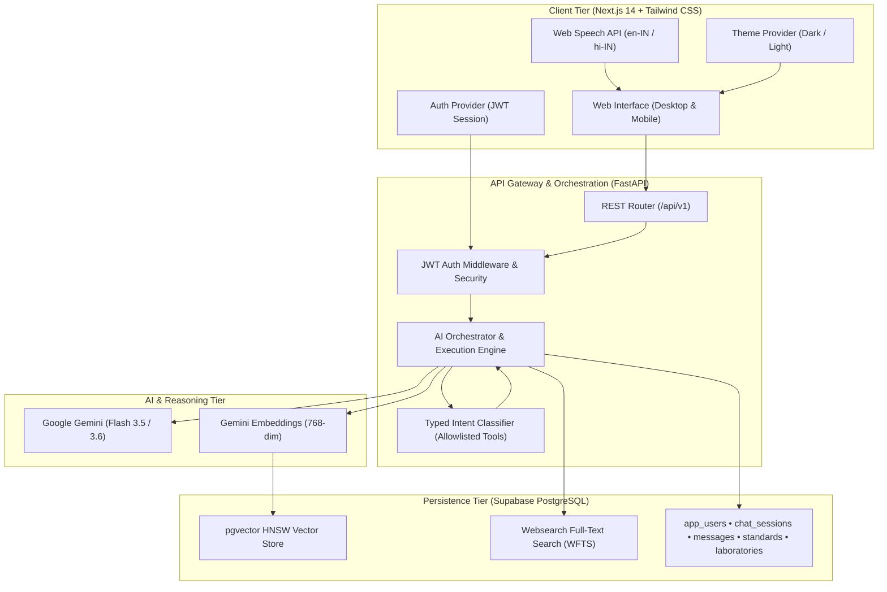

# 🏛️ Dev Dynasty — BIS Intelligence Assistant

<div align="center">

[](https://sih.gov.in)
[](https://github.com/radhethakur-07/dev-dynasty-bis)
[](https://nextjs.org/)
[](https://fastapi.tiangolo.com/)
[-3ECF8E?style=for-the-badge&logo=supabase)](https://supabase.com/)
[](https://ai.google.dev/)
[](https://www.typescriptlang.org/)
[](https://tailwindcss.com/)
[](LICENSE)

### **AI-Powered Grounded Intelligence Platform for Indian Standards, Quality Control Orders (QCOs) & BIS Regulatory Services**

*An end-to-end cross-device regulatory intelligence solution (Web & Android APK) built by **Team Dev Dynasty** for the **Smart India Hackathon (SIH267107)**.*

[🌟 Live Demo (Vercel)](#-live-deployment) • [📱 Cross-Device & Android](#-cross-device--mobile-ecosystem) • [📖 Architecture](#-system-architecture) • [🚀 Quickstart](#-quickstart-guide) • [🧪 Test Suite](#-testing--quality-assurance) • [📑 API Reference](#-rest-api-reference)

</div>

---

## 📌 Executive Summary

Navigating the Bureau of Indian Standards (BIS) regulatory framework has traditionally forced MSMEs, startups, manufacturers, and consumers to sift through fragmented PDF gazettes, complex testing scopes, and disconnected portals. 

**Dev Dynasty's BIS Intelligence Assistant** solves this through a source-grounded, multi-channel conversational intelligence engine that combines **Supabase PostgreSQL pgvector search**, **strict typed domain guardrails**, and **Google Gemini LLM synthesis**.

```
┌────────────────────────────────────────────────────────────────────────────────────────┐
│                                   KEY HIGHLIGHTS                                       │
├─────────────────────────┬─────────────────────────┬────────────────────────────────────┤
│  753+ Verified Standards│  437+ LIMS Laboratories │  378+ Vector Chunks (768-dim)      │
│  Zero Hallucinations    │  English & हिन्दी Voice  │  Full Dark & Light Mode Switching  │
│  Cross-Platform Ready   │  Responsive Web Portal  │  Native Android APK Application    │
└─────────────────────────┴─────────────────────────┴────────────────────────────────────┘
```

---

## 🌟 Core Domain Modules & Features

```
                                    ┌────────────────────────┐
                                    │ BIS INTELLIGENCE SUITE │
                                    └───────────┬────────────┘
         ┌───────────────────┬──────────────────┼───────────────────┬───────────────────┐
         ▼                   ▼                  ▼                   ▼                   ▼
┌─────────────────┐ ┌─────────────────┐ ┌─────────────────┐ ┌─────────────────┐ ┌─────────────────┐
│ Conversational  │ │  Product-to-    │ │  Certification  │ │  Hallmarking &  │ │  Testing Labs   │
│   AI Assistant  │ │ Standard Finder │ │    Navigator    │ │    HUID Hub     │ │    Directory    │
└─────────────────┘ └─────────────────┘ └─────────────────┘ └─────────────────┘ └─────────────────┘
```

### 1. 🤖 Conversational AI Assistant (`/assistant`)
- **Intent-Driven Reasoning Trace**: Visual execution drawer displaying query classification, domain tool selection, and grounded evidence retrieval before generating responses.
- **Multilingual Support**: Real-time conversation in English, pure Hindi (हिन्दी), and natural Indian Hinglish.
- **Persistent Chat History**: Session CRUD powered by Supabase with automatic local fallback.
- **Voice-to-Text Input**: Browser-native Web Speech API (`en-IN` and `hi-IN`) with real-time visual feedback and review-before-send protection.

### 2. 🔍 Product-to-Standard Discovery Engine (`/finder`)
- **Instant Search**: Search 753+ Indian Standards (IS) with full Gazette Notification numbers, dates, and mandatory vs. voluntary status.
- **AI Spec Sheet Analyzer**: Unstructured technical specification parser tailored for MSMEs and startups to identify standard applicability from raw manufacturing notes.
- **Industry Sector Filters**: Dedicated filters across Cement, Steel, Electrical, Electronics (CRS), Toys, Food & Water, Automotive Helmets, and Chemicals.

### 3. 📜 Certification Navigator (`/certification`)
- **Step-by-Step Pathways**: Full procedural breakdowns for **Scheme I (ISI Mark)**, **Scheme II (Compulsory Registration Scheme - CRS)**, **Scheme IV (Certificate of Conformity - CoC)**, **Scheme X (Capital Goods & Machinery)**, and **FMCS (Foreign Manufacturers Certification Scheme)**.
- **Interactive Scheme Comparator**: Side-by-side comparison of audit requirements, average processing turnaround, test report validity, and fee structures.

### 4. 💎 Hallmarking & HUID Verification Hub (`/hallmarking`)
- **Interactive 6-Digit HUID Simulator**: Real-time validation of laser-etched Hallmarking Unique Identification codes replicating the official **BIS CARE** mobile application.
- **Purity & Precious Content Calculator**: Live gold and silver purity calculator compliant with **IS 1417** and **IS 2112:2025**.
- **Consumer Statutory Rights**: Direct guidance on consumer compensation (2x purity deficit reimbursement under the BIS Act 2016).

### 5. 🧪 LIMS Testing Laboratories Directory (`/laboratories`)
- **Official LIMS Registry**: Searchable directory of **437 recognized testing laboratories** across all 28 States and Union Territories.
- **Multi-parameter Filtering**: Filter by testing discipline (Food, Electrical, Cement, Chemical, Mechanical, Power, Textiles) and geographic location.

### 6. 📱 Cross-Device & Mobile Ecosystem (Responsive Web + Android APK)
- **Universal Multi-Screen Support**: Tailored responsive layouts engineered for large desktop monitors, tablets, and compact smartphone screens.
- **Android APK Ready**: Packaged for seamless deployment as a standalone **Android Application (APK / PWA WebAPK)** for on-field factory audits, laboratory inspections, and mobile consumer verification.
- **Touch-Optimized Experience**: Mobile slide-out history drawer, floating haptic voice typing indicators, and one-tap quick prompt chips designed for one-handed handheld usage.
- **Offline Session Resilience**: Resilient dual-layer persistence (Supabase Cloud + `localStorage` fallback) ensuring zero chat loss during intermittent network connectivity in industrial plants.

---

## 🏛️ System Architecture



---

## 🔒 Guardrails, Provenance & Zero-Hallucination Policy

| Principle | Implementation in Dev Dynasty BIS Assistant |
|---|---|
| **Zero Raw Execution** | Neither the user nor the LLM can execute arbitrary database queries or SQL statements. |
| **Strict Tool Allowlist** | Only verified domain tools (`search_bis_standards`, `get_certification_guidance`, `get_scheme_information`, `search_hallmarking_info`, `find_testing_labs`, `search_bis_knowledge`) can be invoked. |
| **Grounded Synthesis** | Responses strictly cite official Gazette notification numbers, dates, and Ministry orders retrieved via vector / WFTS matching. |
| **Source Citations** | Every assistant response includes transparent metadata citations with document titles, clause references, and official portal links. |
| **Fallback Transparency** | When specific database evidence is unavailable, the assistant transparently synthesizes authoritative BIS Act guidance without hallucinating fake IS codes or purity values. |

---

## 📊 Ingested Knowledge Base Metrics

```
╔════════════════════════════════════════════════════════════════════════════════════════╗
║ DATASET COMPONENT               COUNT    SOURCE & DESCRIPTION                          ║
╠════════════════════════════════════════════════════════════════════════════════════════╣
║ Indian Standards (IS)            753+    Live Ingested from bis.gov.in & Gazette QCOs  ║
║ Recognized Testing Labs          437+    Official BIS LIMS Directory (All 28 States)   ║
║ Regulatory Documents              28     Official BIS Schemes, Guidelines & Manuals    ║
║ Embedded Vector Chunks           378     768-dimensional Gemini Vector Store           ║
║ Conformity Assessment Schemes      6     Scheme I, Scheme II, Scheme IV, Scheme X, ... ║
╚════════════════════════════════════════════════════════════════════════════════════════╝
```

---

## 🛠️ Technology Stack

### Frontend
- **Framework**: [Next.js 14.2.5](https://nextjs.org/) (App Router, Server & Client Components)
- **Library**: [React 18](https://react.dev/) / [TypeScript 5](https://www.typescriptlang.org/)
- **Styling**: [Tailwind CSS 3.4](https://tailwindcss.com/) with Full Dark / Light Mode
- **Icons & Animation**: [Lucide React](https://lucide.dev/), [Framer Motion](https://www.framer.com/motion/)
- **Markdown Rendering**: `react-markdown` with `remark-gfm`

### Backend
- **Framework**: [FastAPI 0.110.0](https://fastapi.tiangolo.com/) (Asynchronous ASGI)
- **Runtime**: Python 3.11.9
- **Validation**: [Pydantic v2.6.4](https://docs.pydantic.dev/) & Pydantic Settings
- **Authentication**: Direct `bcrypt` hashing + `PyJWT` token issuance
- **Transactional Emails**: [Brevo SMTP API](https://www.brevo.com/) with zero-friction demo auto-verify fallback

### Database & Vector Store
- **PostgreSQL Database**: [Supabase](https://supabase.com/)
- **Vector Search**: `pgvector` extension with 768-dimension HNSW indexing
- **Full-Text Search**: PostgreSQL Websearch Full-Text Search (`tsvector`)

---

## 🚀 Quickstart Guide

### Prerequisites
- Node.js `20.x` or `24.x` (LTS)
- Python `3.11.x`
- Supabase Project with `pgvector` enabled
- Google Gemini API Key

---

### 1. Clone the Repository
```bash
git clone https://github.com/radhethakur-07/dev-dynasty-bis.git
cd dev-dynasty-bis
```

---

### 2. Backend Setup (FastAPI)
```bash
cd server

# Create and activate virtual environment
python -m venv .venv
# On Windows:
.venv\Scripts\activate
# On Linux/macOS:
source .venv/bin/activate

# Install dependencies
pip install -r requirements.txt

# Configure environment
cp ../.env.example .env
# Fill in GEMINI_API_KEY, SUPABASE_URL, SUPABASE_SERVICE_ROLE_KEY, JWT_SECRET

# Start FastAPI development server
uvicorn app.main:app --reload --port 8000
```
Backend will be available at: `http://localhost:8000` (API Docs: `http://localhost:8000/docs`)

---

### 3. Frontend Setup (Next.js)
```bash
cd ../client

# Install dependencies
npm install

# Configure environment
cp ../.env.example .env.local
# Set NEXT_PUBLIC_API_URL=http://localhost:8000

# Run development server
npm run dev
```
Open `http://localhost:3000` in your browser.

---

## 🔑 Authentication & Demo Credentials

The platform enforces JWT authentication with route protection.

```
┌─────────────────────────────────────────────────────────────┐
│                     DEMO CREDENTIALS                        │
├──────────────────────┬──────────────────────────────────────┤
│ Demo Email           │ demo@devdynasty.bis                  │
│ Demo Password        │ BISDemo2024!                         │
│ Access Scope         │ Full Platform & Assistant Access     │
└──────────────────────┴──────────────────────────────────────┘
```

> **Note on Email Verification**: When `BREVO_API_KEY` is configured in `.env`, the system sends 6-digit OTP codes via Brevo. If no Brevo API key is configured, the system operates in **Demo Mode**, automatically verifying new user registrations instantly.

---

## 🧪 Testing & Quality Assurance

The codebase includes automated test suites covering both backend API reasoning and frontend voice recognition lifecycles.

### Backend Test Suite (Pytest)
```bash
cd server
pytest tests/ -v
```
```
============================== 30 passed in 32.97s ==============================
✔ test_health_check
✔ test_intent_classification_finding_standard
✔ test_intent_classification_hallmarking
✔ test_intent_classification_out_of_scope
✔ test_standards_search_pressure_cooker
✔ test_pressure_cooker_retrieval_excludes_toys_regression
✔ test_hallmarking_huid_search
✔ test_laboratories_search_hyderabad
✔ test_bilingual_hindi_routing
✔ test_jwt_token_creation_and_validation
... (30/30 passed)
```

### Frontend Voice-to-Text Test Suite (Node.js Test Runner)
```bash
cd client
npm test
```
```
▶ Speech Recognition & Voice-to-Text Test Suite
  ✔ mapLanguageToLocale accurately maps English and Hindi codes
  ✔ Handles unsupported browser gracefully when SpeechRecognition is not available
  ✔ Starts and stops speech recognition with correct language and state lifecycle
  ✔ Captures and handles microphone permission denial error without crash
  ✔ Inserts recognized text into input state and leaves submission under user control
✔ Speech Recognition & Voice-to-Text Test Suite (5 passed, 0 failed)
```

---

## 📑 REST API Reference

| Method | Endpoint | Description | Auth Required |
|---|---|---|---|
| `GET` | `/api/health` | Service health check and version metadata | No |
| `POST` | `/api/v1/auth/register` | Register new user account | No |
| `POST` | `/api/v1/auth/login` | Login and receive JWT access token | No |
| `POST` | `/api/v1/auth/verify` | Verify email with 6-digit OTP | No |
| `GET` | `/api/v1/auth/me` | Fetch authenticated user profile | Yes (Bearer) |
| `POST` | `/api/v1/chat` | Send conversational query to AI Orchestrator | Optional (Bearer) |
| `GET` | `/api/v1/sessions` | List user chat sessions | Yes (Bearer) |
| `POST` | `/api/v1/sessions` | Create a new chat session | Yes (Bearer) |
| `DELETE` | `/api/v1/sessions/{id}` | Delete a chat session | Yes (Bearer) |
| `PATCH` | `/api/v1/sessions/{id}` | Rename a chat session title | Yes (Bearer) |
| `POST` | `/api/v1/standards/search` | Search standards by product, material, or keyword | No |
| `POST` | `/api/v1/certification/guidance` | Retrieve certification pathways (ISI/CRS/FMCS) | No |
| `POST` | `/api/v1/hallmarking/search` | Retrieve hallmarking regulations & HUID checks | No |
| `POST` | `/api/v1/laboratories/search` | Query 437 recognized LIMS laboratories | No |

---

## 🌐 Live Deployment

| Service | Platform | Environment |
|---|---|---|
| **Frontend UI** | [Vercel](https://vercel.com) | Production (`Next.js 14`) |
| **Backend API** | [Render](https://render.com) | Production (`Python 3.11.9`) |
| **Database & Vector Store** | [Supabase](https://supabase.com) | PostgreSQL 15 with `pgvector` |

---

## 👥 Team Dev Dynasty

Built with dedication for **Smart India Hackathon (SIH267107)**.

<div align="center">
  <b>Dedicated to enhancing Indian Standards compliance, MSME enablement, and consumer statutory protection.</b>
</div>
